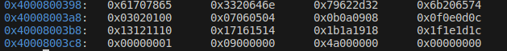
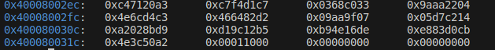
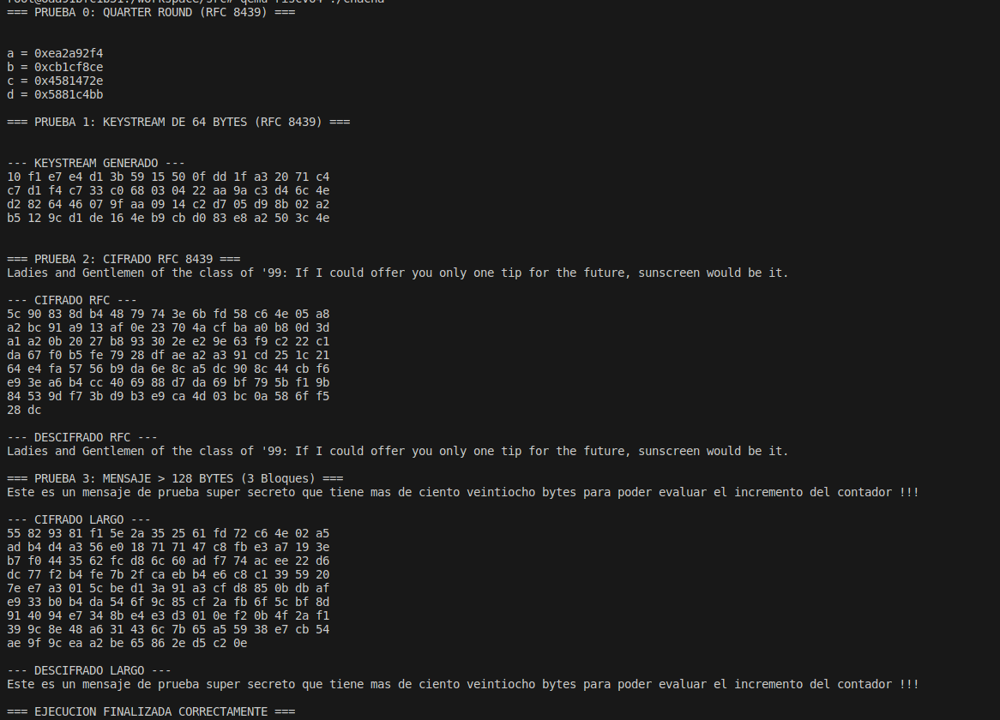

# Documentación Arquitectónica: ChaCha20 en RISC-V

## 1. Arquitectura del Software
El proyecto está diseñado en dos capas claramente separadas:
* **Capa de Alto Nivel (C):** `main.c` se encarga de declarar el estado inicial virgen (constantes, clave de 256 bits, contador, nonce), los buffers de datos y llamar a la función de cifrado.
* **Capa de Bajo Nivel (Ensamblador RISC-V):** Se dividió en módulos para respetar el flujo del RFC 8439. 
  * `quarter_round` modifica 4 palabras in-place recibiendo sus punteros.
  * `chacha20_block` gestiona el bucle de las 20 rondas y el *feedforward*.
  * `chacha20_encrypt` administra la partición del mensaje en bloques de 64 bytes, incrementa el contador de bloque (palabra 12) y aplica la máscara XOR.

**Justificación de diseño:** Se utilizó un *driver* propio en `syscall.S` para imprimir datos (`ecall` servicio 64) en lugar de incluir librerías estándar como `stdio.h`, manteniendo el proyecto 100% *bare-metal* y evitando dependencias externas que alteren el mapa de memoria.

## 2. Mapeo del Estado y Registros RISC-V
El estado de ChaCha20 consta de 16 palabras de 32 bits (64 bytes). Debido a la escasez de registros temporales (`caller-saved`) que sobrevivan a las llamadas de subrutinas (`call quarter_round`), **se decidió mapear el estado de trabajo (working state) dinámicamente en el Stack Frame (La Pila)**.

* El estado se copia desde memoria (`a0`) hacia el *Stack* (`sp` a `sp+60`).
* En cada ronda, `chacha20_block` pasa las direcciones de memoria de las 4 palabras correspondientes a `quarter_round` utilizando los registros de argumentos `a0`, `a1`, `a2`, y `a3`.
* `quarter_round` carga las palabras en registros temporales (`t0`, `t1`, `t2`, `t3`), realiza las operaciones lógicas y aritméticas, y las vuelve a guardar en el stack.
* Esto evita la saturación de registros y previene la corrupción de datos durante las 20 iteraciones cruzadas.

## 3. Evidencias de Ejecución

A continuación se muestran las capturas de pantalla de la ejecución en QEMU y GDB:

**Estado del bloque en la memoria (Stack) antes de las 20 rondas:**

**Estado del bloque en la memoria (Stack) después de las 20 rondas (Keystream):**

**Verificación de los vectores RFC y prueba multi-bloque (Salida de Consola):**

## 4. Bitácora de Bugs: Memoria no Mapeada en Bare-Metal (Segmentation Fault)
* **Descripción del Bug:** Al compilar y ejecutar el algoritmo de cifrado, QEMU lanzaba un error de *Segmentation Fault (core dumped)* interrumpiendo abruptamente el programa antes de imprimir cualquier resultado.
* **Detección e Investigación:** El programa fallaba exactamente en la primera instrucción de ensamblador que intentaba almacenar un byte (`sb`) en los arreglos de salida `ciphertext` y `decrypted`. Al investigar el entorno, se notó que dichos arreglos habían sido declarados como variables globales en el archivo C. Al compilar con la bandera `-nostdlib` (bare-metal), no existe el archivo de inicialización del entorno C (`crt0`), por lo que la sección de memoria `.bss` (donde van las globales) no es mapeada ni asignada en la memoria RAM del simulador QEMU.
* **El Fix:** Se resolvió moviendo las declaraciones de los arreglos al interior de la función `main()`. Esto los convirtió en variables locales, obligando al compilador a asignarles espacio dinámicamente dentro del **Stack** (La Pila). Dado que el Stack sí se inicializa y cuenta con permisos de lectura/escritura desde el arranque del sistema, el error de segmentación desapareció. Además, se añadió la palabra clave `volatile` para evitar que el compilador borrara los arreglos como parte de la optimización agresiva de GCC (`-O2`).

## 5. Análisis de Resultados
La implementación superó exitosamente todas las pruebas del RFC 8439 y el procesamiento de mensajes mayores a 64 bytes (probado con un mensaje de 140 bytes, abarcando 3 bloques). Esto demuestra que la lógica de orquestación incrementa correctamente la palabra 12 del estado por cada bloque, generando flujos de *keystream* independientes que, sumados al manejo riguroso de la pila y las convenciones del ABI de RISC-V, resultan en una máquina criptográfica funcional, estable y completamente bare-metal.